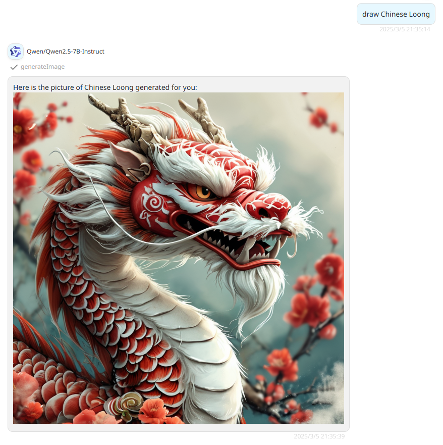

# KolorsSiliconFlowAPI (Kwai-Kolors/Kolors)

> Kolors is a large-scale text-to-image generation model based on latent diffusion developed by the Kuaishou Kolors team. The model has been trained on billions of text-image pairs and has shown significant advantages in visual quality, complex semantic accuracy, and Chinese and English character rendering. It not only supports Chinese and English input, but also performs well in understanding and generating Chinese-specific content.

> Refer to [SiliconFlow API Manual of images-generation](https://docs.siliconflow.cn/cn/api-reference/images/images-generations)

## Schema
[openapi.json](./openapi.json)

## Servers

`https://api.siliconflow.cn/v1`

## Supported Models

## Limits

> refering to [SiliconFlow Function Calling](https://docs.siliconflow.cn/cn/userguide/guides/function-calling)

Only available in the those models supports function-calling.

In SiliconFlow, the models support function-calling are:

- Deepseek 系列：
    - deepseek-ai/DeepSeek-V2.5

- 书生系列：
  - internlm/internlm2_5-20b-chat
  - internlm/internlm2_5-7b-chat
  - Pro/internlm/internlm2_5-7b-chat

- Qwen系列：
  - Qwen/Qwen2.5-72B-Instruct
  - Qwen/Qwen2.5-32B-Instruct
  - Qwen/Qwen2.5-14B-Instruct
  - Qwen/Qwen2.5-7B-Instruct
  - Pro/Qwen/Qwen2.5-7B-Instruct

- GLM 系列：
  - THUDM/glm-4-9b-chat
  - Pro/THUDM/glm-4-9b-chat

> Also, other models by other providers that can raise function-calling are supported.


## Authentication

```
type: bearer
location: header
```

## Preview




