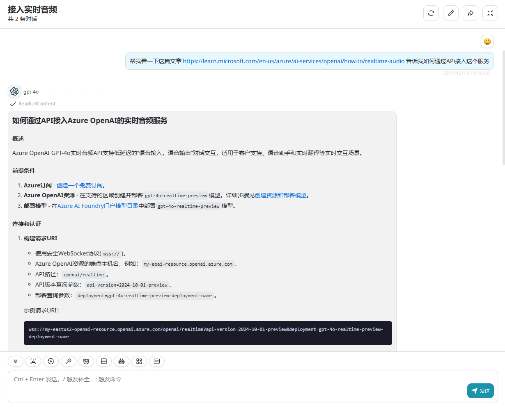

# Jina URL Content Reader

> Fetches the text content from a personal website.
> Retrieves the contents of a specified URL and converts it to LLM-friendly Markdown format.

## Schema
[openapi.json](./openapi.json)

## Servers

`https://r.jina.ai`

## Operations

1. ReadUrlContent

## Authentication

```
type: none
```

## Preview

