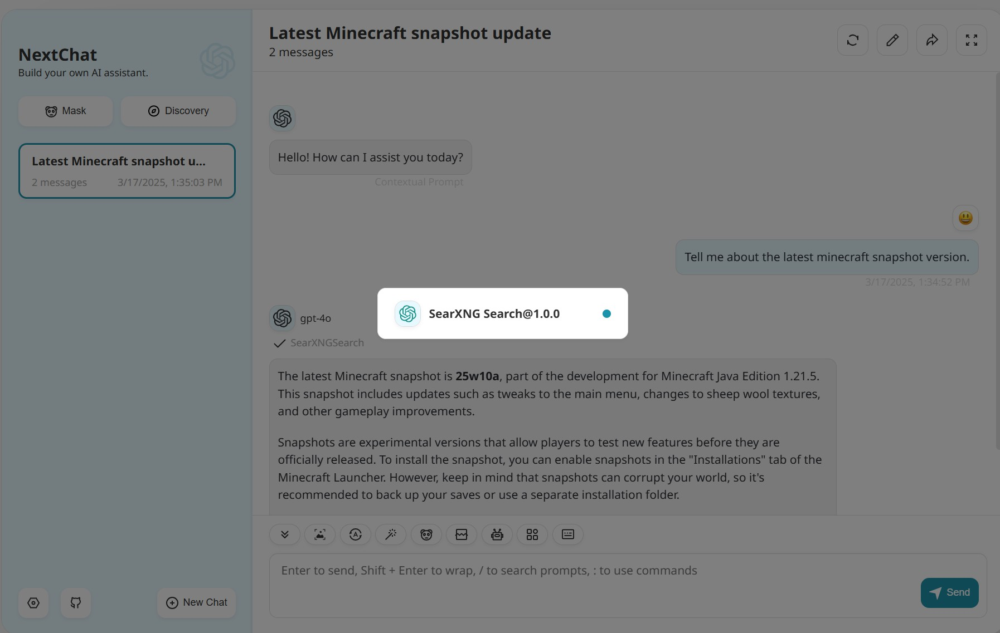

# SearXNGSearch

NextChat plugin that connects the model and SearXNG search engine.

## Schema

[openapi.json](./openapi.json)

## Servers

You can use one of the public instances:
[Public SearXNG Instances](https://uptime.searxng.org/)
Or use your own instance (recommended). Either way you will need to modify `openapi.json`:

```json
  "servers": [
    {
      "url": "https://YOUR_SEARXNG_INSTANCE_URL",
      "description": "SearXNG instance URL."
    }
  ],
```


## Operations

1. SearXNGSearch

> `GET` /search

## Authentication

```
type: none
```

## Preview

Tested with local docker deployment on Mar.17 2025, using a private searxng instance.

