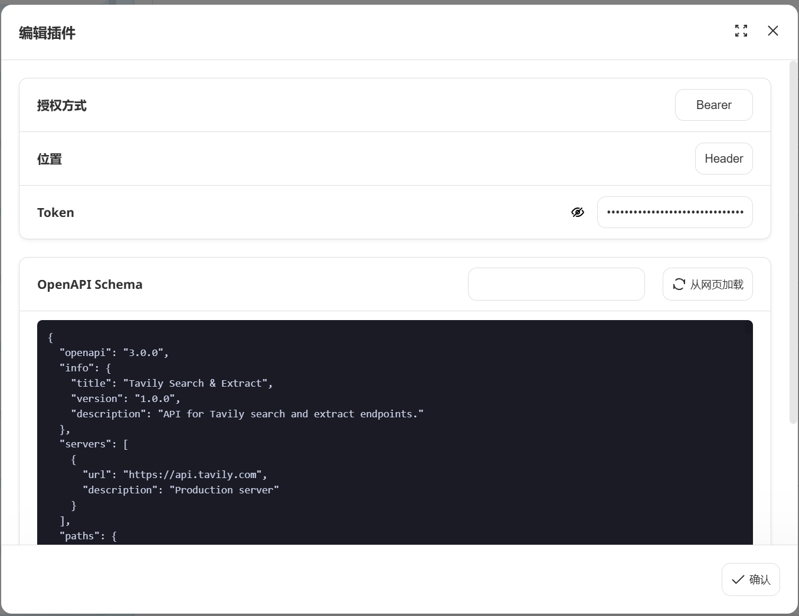
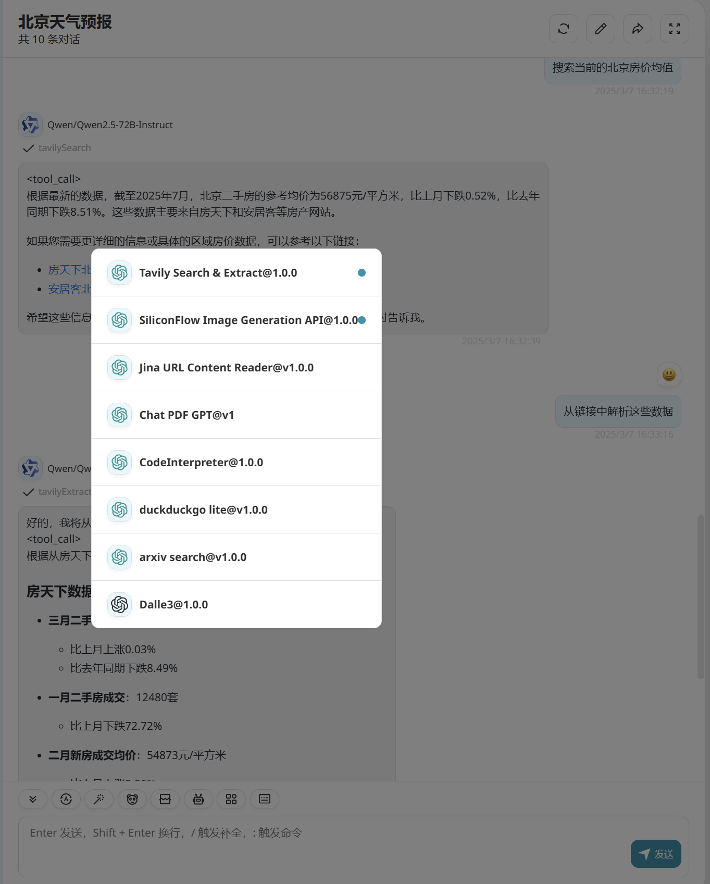

# Tavily Search & Extract

> Tavily is a search engine optimized for LLMs, aimed at efficient, quick and persistent search results. 

## Get an API Key

[request an API key](https://app.tavily.com/)

## Schema
[openapi.json](./openapi.json)

## Servers

`https://api.tavily.com`

## Operations

1. Tavily Search
> `POST` path=`/search` body=`{'query': <your query>}`

2. Tavily Extract
> `POST` path=`/extract` body=`{'urls': <your url>}`

## Authentication

```
type: Bearer
position: header
```



## Preview




